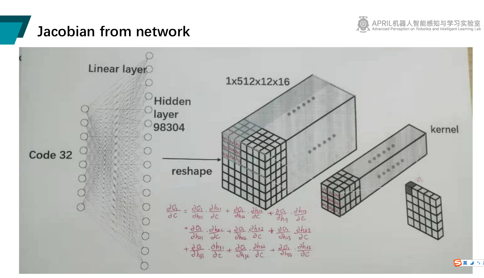
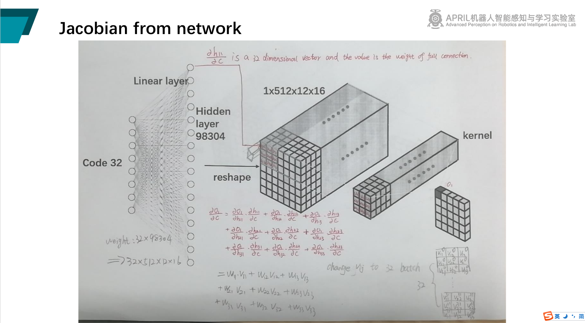
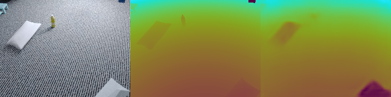

### News
Large-scale Online Dense Mapping for UAV ([LODM](https://github.com/hjxwhy/LODM)) traing code has released. It is submitted to IROS 2022. 
# CodeSLAM
Unofficial implement of "CodeSLAM — Learning a Compact, Optimisable Representation for Dense Visual SLAM" 
and "DeepFactors: Real-Time Probabilistic Dense Monocular SLAM".

### Notice
This repo have replicate the Jacobian calculation though network forward, 
But I'm not sure if the original author solved it this way, but I can achieve about the same speed as the paper with this approach.
The method is that propagate the linear weight as the fellow fig:



### Install
Create a conda environment and install requirements
```
conda create -n tandem python=3.7
conda activate tandem
conda install pytorch==1.5.1 torchvision==0.6.1 cudatoolkit=10.2 -c pytorch

pip install -r requirements.txt
```

**Comment:** The environment uses PyTorch `1.5.1` and PyTorch-Lightning `0.7.6` because this was the environment we used for development. 

### Training
Config values are documented in `config/default.yaml`.  You can start a training with
```
python train.py --config config/default.yaml path/to/out/folder DATA.ROOT_DIR $TANDEM_DATA_DIR
```
### Result
The boundary is blur, the VAE encode to low dimension will lose high frequency.



# Acknowledgements
thanks for [TANDEM](https://github.com/tum-vision/tandem.git), My code is build on it's framework.